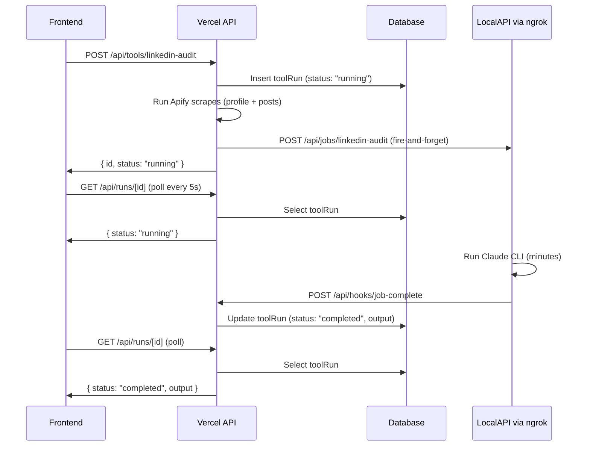

# Background Job Architecture for LinkedIn Audit

## Problem

The LinkedIn audit runs synchronously inside a Vercel serverless function. The full pipeline (Apify scraping + multi-turn Claude session) easily exceeds Vercel's timeout limit, causing `FUNCTION_INVOCATION_TIMEOUT`.

## Architecture



## Data Structures

### DB Schema Change: add `output` column to `toolRuns`

In [src/lib/schema.ts](src/lib/schema.ts), add a text column for storing the audit output directly (currently only `outputUrl` exists, which is unused):

```typescript
output: text("output"),  // stores the generated audit text
```

Also update the `ToolRun` type in [src/lib/types.ts](src/lib/types.ts) to include `output: string | null`.

### API: POST /api/tools/linkedin-audit (Vercel)

**Request** (unchanged):

```json
{ "linkedinUrl": "https://linkedin.com/in/some-user" }
```

**What it does now:**

1. Creates `toolRun` record with `status: "running"`
2. Runs Apify scrapes (profile + posts) -- stays in Vercel since these are fast enough
3. Fires off POST to `{ngrokBase}/api/jobs/linkedin-audit` with scraped data (does NOT await the response -- uses a fire-and-forget fetch)
4. Immediately returns

**Response** (returns immediately):

```json
{ "id": "cuid_abc123", "status": "running" }
```

**Fire-and-forget payload sent to local-api:**

```json
{
  "runId": "cuid_abc123",
  "slug": "some-user",
  "profileData": { ... },
  "postsData": [ ... ],
  "callbackUrl": "https://your-app.vercel.app/api/hooks/job-complete"
}
```

### API: POST /api/jobs/linkedin-audit (local-api)

New route on the local-api Express server. Receives scraped data + run metadata, immediately responds `202 Accepted`, then runs the Claude CLI in the background. When done, POSTs result to the callback URL.

**Request:** the fire-and-forget payload above.

**Immediate response:** `{ "status": "accepted" }`

**Background work:**

1. Read example `.docx` files from disk (these are already accessible on the local machine)
2. Run Claude CLI with the prompt + scraped data + example docs
3. POST result to `callbackUrl`

**Callback payload (success):**

```json
{
  "runId": "cuid_abc123",
  "status": "completed",
  "output": "... full audit text ...",
  "apiKey": "<shared secret for auth>"
}
```

**Callback payload (failure):**

```json
{
  "runId": "cuid_abc123",
  "status": "failed",
  "error": "claude exited with code 1: ...",
  "apiKey": "<shared secret for auth>"
}
```

### API: POST /api/hooks/job-complete (Vercel, new)

Webhook endpoint that local-api calls when a job finishes.

**Auth:** Validates `apiKey` in the body matches `DANNY_LOCAL_API_KEY` env var.

**Request body:** the callback payload above.

**Behavior:**

- Updates the `toolRun` record: sets `status`, `output` or `error`, and `updatedAt`
- On failure: sends Slack notification via existing `sendSlackNotification()`
- Returns `{ ok: true }`

### API: GET /api/runs/[id] (Vercel, new)

Polling endpoint for the frontend.

**Auth:** Validates `x-user-id` header from middleware.

**Response:**

```json
{
  "id": "cuid_abc123",
  "status": "running",
  "output": null,
  "error": null,
  "createdAt": "2026-02-26T...",
  "updatedAt": "2026-02-26T..."
}
```

When `status` becomes `"completed"`, `output` contains the full audit text. When `"failed"`, `error` contains the error message.

## Add maxDuration and Timeout Guard to All API Routes

### maxDuration Export

Export `maxDuration = 300` from every API route file. This gives Vercel Pro the maximum 5-minute window. For the routes using `createToolHandler`, the export needs to be in each route file (Next.js reads it from the route module, not the handler).

Files to update:

- [src/app/api/tools/linkedin-audit/route.ts](src/app/api/tools/linkedin-audit/route.ts)
- [src/app/api/tools/gtm-strategy/route.ts](src/app/api/tools/gtm-strategy/route.ts)
- [src/app/api/tools/sentiment-analysis/route.ts](src/app/api/tools/sentiment-analysis/route.ts)
- [src/app/api/tools/linkedin-humanizer/route.ts](src/app/api/tools/linkedin-humanizer/route.ts)
- [src/app/api/tools/outbound-sequence/route.ts](src/app/api/tools/outbound-sequence/route.ts)
- [src/app/api/history/route.ts](src/app/api/history/route.ts)
- [src/app/api/auth/route.ts](src/app/api/auth/route.ts)
- [src/app/api/resources/route.ts](src/app/api/resources/route.ts)
- [src/app/api/resources/[fileId]/route.ts](src/app/api/resources/[fileId]/route.ts)
- New routes: `/api/hooks/job-complete`, `/api/runs/[id]`

Each file gets: `export const maxDuration = 300;`

### Timeout Guard: Proactive Failure Before Vercel Kills the Process

Since Vercel's `FUNCTION_INVOCATION_TIMEOUT` hard-kills the process (no `catch` block runs, no cleanup), we need a self-imposed deadline that fires **before** Vercel's timeout to send a Slack notification and return a proper error response.

Create a new utility at **[src/lib/timeout-guard.ts](src/lib/timeout-guard.ts)** that wraps route handler logic with `AbortController` + `setTimeout`:

```typescript
import { sendSlackNotification } from "./slack";

const TIMEOUT_BUFFER_SECONDS = 5;

export function withTimeoutGuard<T>(
  fn: (signal: AbortSignal) => Promise<T>,
  opts: {
    maxDuration: number; // same value as the route's maxDuration export
    routeName: string; // for Slack notification context, e.g. "linkedin-audit"
    runId?: string; // optional toolRun ID if applicable
    userName?: string; // optional user name for Slack
  }
): Promise<T> {
  const timeoutMs = (opts.maxDuration - TIMEOUT_BUFFER_SECONDS) * 1000;
  const controller = new AbortController();

  return new Promise<T>((resolve, reject) => {
    const timer = setTimeout(async () => {
      controller.abort();

      await sendSlackNotification({
        tool: opts.routeName,
        userName: opts.userName || "Unknown",
        error: `Route timed out after ${opts.maxDuration - TIMEOUT_BUFFER_SECONDS}s (maxDuration: ${opts.maxDuration}s)`,
        runId: opts.runId || "N/A",
      }).catch(() => {});

      reject(new Error("Route timeout guard triggered"));
    }, timeoutMs);

    fn(controller.signal)
      .then(resolve)
      .catch(reject)
      .finally(() => clearTimeout(timer));
  });
}
```

**How routes use it:**

For the linkedin-audit route (and any other long-running route), the handler wraps its work in `withTimeoutGuard`. The `signal` is passed through to `fetch` calls so they abort promptly when the timer fires:

```typescript
// In route.ts POST handler:
export const maxDuration = 300;

export async function POST(request: NextRequest) {
  // ... parse request, create DB record ...

  try {
    await withTimeoutGuard(
      async (signal) => {
        const scrapedData = await runApifyScrapes(linkedinUrl, signal);
        await fireAndForgetJob(run.id, scrapedData, signal);
      },
      {
        maxDuration: 300,
        routeName: "linkedin-audit",
        runId: run.id,
        userName,
      }
    );
    return NextResponse.json({ id: run.id, status: "running" });
  } catch (error) {
    // Timeout guard or other error -- update DB to failed
    await db
      .update(toolRuns)
      .set({ status: "failed", error: error.message, updatedAt: new Date() })
      .where(eq(toolRuns.id, run.id))
      .catch(() => {});
    return NextResponse.json({ id: run.id, error: error.message }, { status: 500 });
  }
}
```

For the generic tool handler in [src/lib/tool-handler.ts](src/lib/tool-handler.ts), wrap the existing logic similarly. Since most of these routes are lightweight (just a DB insert), the guard is a safety net rather than something expected to fire.

The `signal` (AbortSignal) from the guard is passed into `fetch()` calls (Apify, local-api fire-and-forget) so that in-flight HTTP requests are cancelled immediately when the timeout fires, giving the handler time to send the Slack notification and return a 500 response within the remaining 5-second buffer.

## Frontend Polling Changes

Update [src/components/tool-form.tsx](src/components/tool-form.tsx):

- After form submission receives `{ id, status: "running" }`, start polling `GET /api/runs/{id}` every 5 seconds
- Show a progress state with the run ID (e.g. "Audit in progress...")
- On `status: "completed"`: stop polling, display the output
- On `status: "failed"`: stop polling, show the error
- Add a staleness check: if running for >10 minutes, show "This is taking longer than expected"

## Move Example Docs to local-api

The example `.docx` files currently live at `src/app/api/tools/linkedin-audit/*.docx`. Since Claude now runs from local-api, copy these files into `local-api/data/` and read them from there in the jobs route. The Vercel app no longer needs them.

## Files Summary

- **Create** `src/lib/timeout-guard.ts` -- `withTimeoutGuard` utility with AbortSignal + Slack notification
- **Modify** [src/lib/schema.ts](src/lib/schema.ts) -- add `output` text column
- **Modify** [src/lib/types.ts](src/lib/types.ts) -- add `output` to `ToolRun` type
- **Modify** [src/app/api/tools/linkedin-audit/route.ts](src/app/api/tools/linkedin-audit/route.ts) -- fire-and-forget + maxDuration + timeout guard
- **Modify** [src/lib/linkedin-audit.ts](src/lib/linkedin-audit.ts) -- remove Claude call, just return scraped data, accept AbortSignal
- **Modify** [src/lib/tool-handler.ts](src/lib/tool-handler.ts) -- wrap handler logic with timeout guard
- **Modify** [src/components/tool-form.tsx](src/components/tool-form.tsx) -- add polling logic
- **Modify** [local-api/src/index.ts](local-api/src/index.ts) -- register jobs router
- **Create** `src/app/api/hooks/job-complete/route.ts` -- webhook callback
- **Create** `src/app/api/runs/[id]/route.ts` -- polling endpoint
- **Create** `local-api/src/routes/jobs.ts` -- background job runner
- **Copy** example `.docx` files to `local-api/data/`
- **Add maxDuration = 300** to all 9 existing route files + 2 new ones
- **Generate** DB migration for the new `output` column
