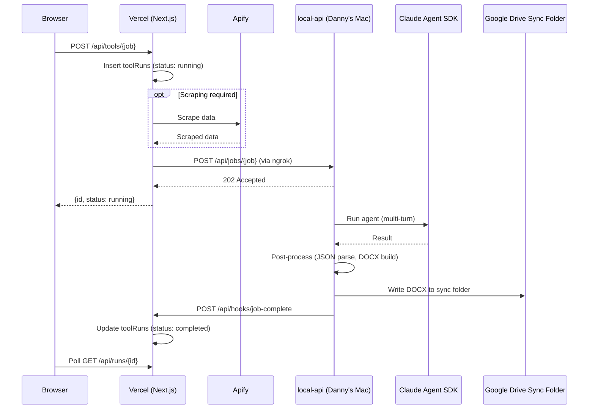
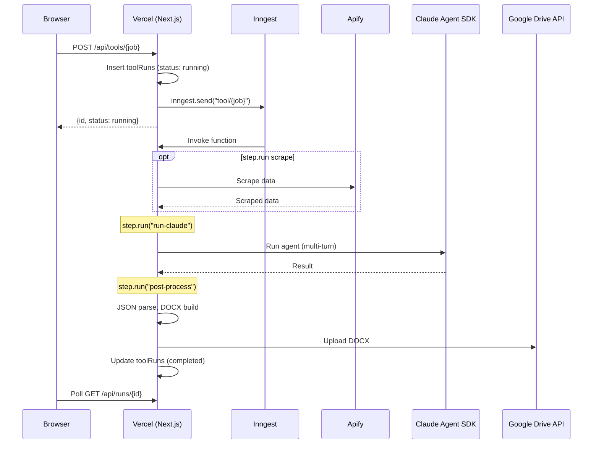

# Background Job Runner - Research and Plan

## 1. Current Code Paths

There are **5 jobs** currently running through local-api, plus 1 tool that doesn't use local-api at all:

| Job | Model | Max Turns | Tools Given to Claude | Scraping Step | Output |
| --- | ----- | --------- | --------------------- | ------------- | ------ |

**Jobs routed through local-api:**

- **gtm-strategy** -- Uses Opus, 25 turns, tools: WebSearch/WebFetch/Read. No scraping. Produces a DOCX written to Google Drive sync folder.
- **sentiment-analysis** -- Uses Haiku, 30 turns, tools: Read/Glob. Apify scraping happens _in the Vercel route_ before dispatching. Produces a DOCX.
- **linkedin-audit** -- Uses Opus, 15 turns, tools: Read. Apify scraping happens _in the Vercel route_ before dispatching. Produces a DOCX.
- **linkedin-humanizer** -- Uses Haiku, 3 turns, no tools. No scraping. Returns plain text (no DOCX).
- **test** -- Uses Haiku, 2 turns, no tools. Returns plain text haiku.

**Not routed through local-api:**

- **outbound-sequence** -- Uses `createToolHandler` which just inserts a `toolRuns` row with status `"pending"`. No Claude processing yet.

### Current Architecture Flow

## 2. Job Characteristics

### Duration

- **linkedin-humanizer / test**: Fast -- likely **10-30 seconds** (2-3 turns of Haiku, no tools)
- **linkedin-audit**: Medium -- likely **1-3 minutes** (15 turns Opus + file reads)
- **gtm-strategy**: Long -- likely **2-5 minutes** (25 turns Opus + web search/fetch)
- **sentiment-analysis**: Long -- likely **2-5 minutes** (30 turns Haiku + file reads)
- Plus scraping time on the Vercel side (Apify) before dispatch

### Reliability Concerns

- **Single point of failure**: Danny's Mac must be running, ngrok must be connected
- **No retry on job failure**: If Claude errors out, the job is marked failed with no retry
- **Callback fragility**: If callback fails after 3 retries, the run is stuck as "running" forever
- **No concurrency control**: Multiple jobs can pile up on the local machine
- **No job queue**: Jobs are fire-and-forget HTTP calls; if local-api crashes mid-job, it's lost
- **Vercel timeout**: Routes use `maxDuration: 300` (5 min) with a timeout guard, but this only covers the dispatch, not the job itself

### Input/Output Sizes

- **Inputs**: Small-to-medium. Largest are `sentiment-analysis` (scraped sources JSON, could be a few hundred KB) and `linkedin-audit` (profile + posts data)
- **Outputs**: Text output stored in DB is small (a summary string). DOCX files are the real output (10-50KB typically), written to filesystem.
- **JSON body limit**: local-api sets `express.json({ limit: "10mb" })`

## 3. Available Tools for Background Job Running

Given the constraints (jobs run 10s to 5+ min, use Claude Agent SDK, produce files), here are the realistic options:

### Option A: Inngest

- **What**: Event-driven durable functions, designed for Next.js
- **Pros**: First-class Vercel/Next.js integration, built-in retries, step functions for breaking work into durable steps, generous free tier, great DX, fan-out/throttling
- **Cons**: 15 min max function duration on most plans (sufficient for current jobs), the Claude Agent SDK streaming loop doesn't map perfectly to Inngest steps
- **Fit**: Strong. Would let you keep everything in the Next.js app and remove local-api entirely. The Apify scrape and Claude run could be separate durable steps.

### Option B: Trigger.dev

- **What**: Open-source background job platform for TypeScript
- **Pros**: Long-running tasks (up to hours), built for AI workloads, retries, concurrency controls, real-time logs, can self-host or use cloud
- **Cons**: Another service to manage, slightly less mature ecosystem than Inngest
- **Fit**: Strong. Purpose-built for exactly this pattern (long-running AI agent jobs).

### Option C: BullMQ + Redis

- **What**: Redis-backed job queue for Node.js
- **Pros**: Battle-tested, full control, retries, priorities, rate limiting, concurrency control
- **Cons**: Need to run Redis + a worker process (can't run in Vercel serverless). Would need a separate worker deployed somewhere (Railway, Fly, EC2)
- **Fit**: Medium. Powerful but requires more infrastructure.

### Option D: QStash (by Upstash)

- **What**: Serverless message queue / HTTP job scheduler
- **Pros**: Serverless, works with Vercel, retries, delays, schedules
- **Cons**: Jobs still need to complete within Vercel's maxDuration (300s on Pro). Not designed for long-running compute.
- **Fit**: Weak for Claude jobs. Better for short webhook-style tasks.

### Option E: Cloud provider queues (AWS SQS + Lambda, GCP Cloud Tasks)

- **Pros**: Highly reliable, scalable
- **Cons**: Heavy infrastructure, doesn't solve the long-running problem (Lambda 15 min max), overkill for current scale
- **Fit**: Weak. Too much infra for the current stage.

### Recommendation: Inngest or Trigger.dev

Both are strong fits. The decision comes down to:

- **Inngest** if you want the simplest integration with your existing Next.js app and jobs stay under ~15 min. You define functions right in your Next.js codebase and Inngest handles queuing, retries, and execution. No separate worker to deploy.
- **Trigger.dev** if you want more flexibility on execution duration (hours) or want the option to self-host later. Slightly more setup but purpose-built for AI agent workloads.

## 4. Implementation Plan (assuming Inngest)

### What changes

- **Remove**: The entire `local-api/` directory, ngrok tunnel, `NGROK_BASE_URL` env var
- **Add**: Inngest client + functions in the Next.js app
- **Move**: Claude Agent SDK calls, DOCX builders, and schemas into the main Next.js codebase
- **Change**: File output from local Google Drive sync folder to Google Drive API upload (via existing `gdrive.ts`)

### New architecture

### Implementation steps

1. **Install Inngest** -- `npm install inngest`, create `src/inngest/client.ts` and `src/app/api/inngest/route.ts` (the serve endpoint)
2. **Move shared code from local-api into Next.js app**:

- `local-api/src/lib/claude-runner.ts` -> `src/lib/claude-runner.ts`
- `local-api/src/lib/job-utils.ts` -> merge into existing utils
- `local-api/src/lib/*-schema.ts` and `*-docx-builder.ts` -> `src/lib/docx/`

1. **Define Inngest functions** (one per job) in `src/inngest/functions/`:

- Each function receives the job payload via event data
- Uses `step.run()` for durable steps (scrape, claude, post-process, upload)
- Updates `toolRuns` directly via Drizzle (no callback webhook needed)

1. **Update tool route handlers**:

- Instead of `fetch(ngrokBase/api/jobs/...)`, call `inngest.send({ name: "tool/gtm-strategy", data: { ... } })`
- Remove timeout guard (Inngest handles timeouts/retries)
- Keep the initial `toolRuns` insert

1. **Replace file output with Google Drive API upload**:

- Extend `gdrive.ts` with an `uploadFile(name, buffer, folderId)` function
- DOCX builders return a `Buffer` instead of writing to disk
- Store the Drive file URL in `toolRuns.outputUrl`

1. **Remove local-api** and associated infrastructure (ngrok, `.env` vars, the `local-api/` directory)
2. **Remove the job-complete webhook** (`/api/hooks/job-complete`) -- no longer needed since Inngest functions update the DB directly

### Key consideration: Claude Agent SDK on Vercel

The Claude Agent SDK spawns a local process. This works on Vercel serverless functions but with caveats:

- Vercel Pro allows up to 300s (5 min) `maxDuration` per function invocation
- Inngest can extend this with step-level timeouts, but a single `step.run()` containing the Claude loop still needs to finish within Vercel's limit
- If jobs regularly exceed 5 min, you'd need **Trigger.dev** (which runs its own worker) or deploy the Inngest functions on a long-running server (Railway, Fly)
- For current job sizes (2-5 min), Vercel Pro's 300s should be sufficient
