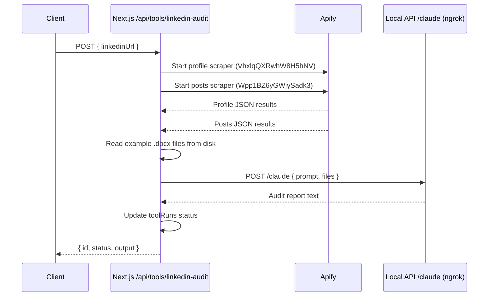

# LinkedIn Audit Apify Integration

## Architecture

The linkedin-audit tool handler currently creates a `toolRuns` DB record and returns immediately (stub). We will replace this with a full implementation that:

1. Kicks off two Apify actor runs in parallel (profile + posts)
2. Polls/waits for both to complete
3. Downloads the JSON results
4. Reads the two example `.docx` files from disk
5. Sends everything to the Claude local API endpoint via ngrok
6. Updates the `toolRuns` record with the result



## Environment Variables

Add to `[.env.local](.env.local)`:

```
APIFY_API_TOKEN=apify_api_0mY6oQbCiXwDHdcfd6cK0mUbgaJIZb2aotxo
APIFY_USER_ID=591cOSrwvLkcXuzbb
NGROK_BASE_URL=https://waterlike-shelby-zebrine.ngrok-free.dev
```

`DANNY_LOCAL_API_KEY` already exists in `.env.local` and matches the `DANNY_LOCAL_API_KEY` in `local-api/.env`.

## Implementation: New Apify + Claude integration module

Create a dedicated module at `[src/lib/linkedin-audit.ts](src/lib/linkedin-audit.ts)` containing:

### 1. `runApifyActor(actorId, input)` helper

- POST to `https://api.apify.com/v2/acts/{actorId}/run-sync-get-dataset-items?token={APIFY_API_TOKEN}` with the JSON input
- Use the **synchronous run** endpoint so we get results directly without polling (LinkedIn scrapes typically finish well within the 300s timeout)
- Returns the parsed JSON array of dataset items

### 2. `runLinkedInAudit(linkedinUrl)` main function

- Extract the user slug from the URL (e.g. `danny-jones` from `https://www.linkedin.com/in/danny-jones`)
- Fire both Apify calls in parallel using `Promise.all`:
  - **Profile scraper** (`VhxlqQXRwhW8H5hNV`): input `{ "username": "<slug>" }`
  - **Posts scraper** (`Wpp1BZ6yGWjySadk3`): input `{ "urls": ["<linkedinUrl>"], "limitPerSource": 20, "deepScrape": true }`
- Read both example `.docx` files from `src/app/api/tools/linkedin-audit/` using `fs.readFile` and base64-encode them
- Build the request to `POST {NGROK_BASE_URL}/claude` with:
  - Header: `x-api-key: {DANNY_LOCAL_API_KEY}`
  - Body:

```json
{
  "prompt": "Create a linkedin profile audit for https://www.linkedin.com/in/<USER_SLUG>. Attached is data scraped from their LinkedIn page and a couple of example reports for different accounts so you can match the formatting.",
  "files": {
    "scraped-profile.json": "<profile JSON stringified>",
    "scraped-posts.json": "<posts JSON stringified>",
    "example-jonathan-low-audit.docx": "<base64 content>",
    "example-kamil-sidor-audit.docx": "<base64 content>"
  },
  "maxTurns": 5
}
```

- Return Claude's output text

### Note on .docx files

The Claude route in `local-api` writes files to a temp directory and runs `claude` CLI with that as `cwd`. The CLI can read `.docx` files natively, but we need the content to be written as actual binary files, not base64 text. So we will base64-decode the content before writing. **However**, looking at the existing claude route, it writes files as `utf-8` text strings. We have two options:

- **Option A**: Send the docx content as base64 in the `files` map and modify the Claude route to detect and decode base64 for binary files.
- **Option B**: Send only the JSON data files to Claude (as text), and modify the Claude route to accept a list of local file paths to copy into the session dir.
- **Option C**: Since the `.docx` files are static examples, hardcode their paths in the Claude route or copy them into the session dir from a known location on the local machine.

**Recommended: Option A** -- add a `binaryFiles` field to the Claude route that accepts `Record<string, string>` (filename to base64), and writes them as binary buffers. This keeps the API clean and general-purpose.

## Changes to `[local-api/src/routes/claude.ts](local-api/src/routes/claude.ts)`

Add a `binaryFiles` field to `ClaudeRequest`:

```typescript
interface ClaudeRequest {
  prompt: string;
  files?: Record<string, string>; // filename -> text content
  binaryFiles?: Record<string, string>; // filename -> base64 content
  maxTurns?: number;
}
```

In the handler, after writing text files, loop over `binaryFiles` and write each as a `Buffer.from(content, 'base64')`.

## Changes to `[src/lib/tool-handler.ts](src/lib/tool-handler.ts)` (linkedin-audit specific)

Rather than making `createToolHandler` generic for all tools, we will create a **dedicated route handler** in `[src/app/api/tools/linkedin-audit/route.ts](src/app/api/tools/linkedin-audit/route.ts)` that:

1. Creates the `toolRuns` record (status: `pending`)
2. Calls `runLinkedInAudit(linkedinUrl)`
3. Updates the record to `completed` with the output, or `failed` with error
4. Returns the result

This replaces the current one-liner that delegates to `createToolHandler`. We keep `createToolHandler` for the other tools that are still stubs.

## File Summary

| File                                        | Action                                                               |
| ------------------------------------------- | -------------------------------------------------------------------- |
| `.env.local`                                | Add `APIFY_API_TOKEN`, `APIFY_USER_ID`, `NGROK_BASE_URL`             |
| `src/lib/linkedin-audit.ts`                 | **New** -- Apify calls + Claude request orchestration                |
| `src/app/api/tools/linkedin-audit/route.ts` | **Replace** -- full handler with Apify + Claude integration          |
| `local-api/src/routes/claude.ts`            | **Edit** -- add `binaryFiles` support for base64 binary file uploads |
