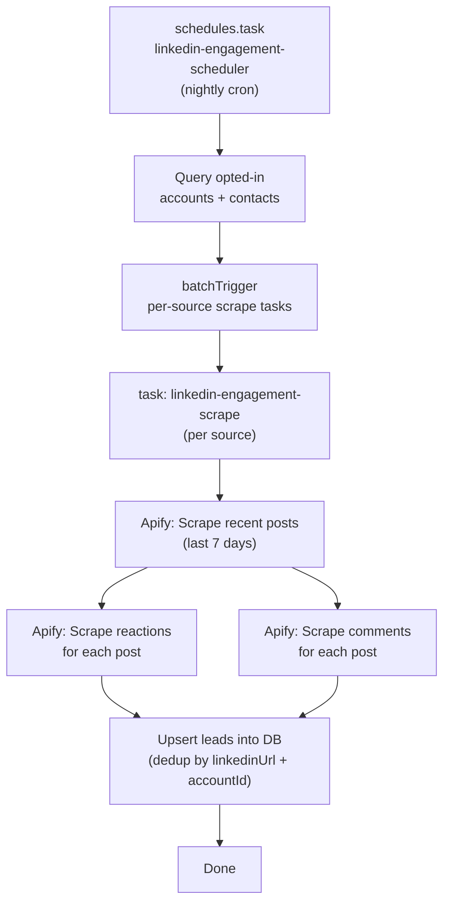

# LinkedIn Engagement Scrape

## Key Concepts

- **Contacts** are people MVRX works with (our customers' team members). They belong to an **account** (the customer org).
- **Leads** are people discovered through engagement scraping. A lead is _for_ a contact (or account) -- it represents someone who engaged with that contact's LinkedIn content, making them a potential prospect for outreach.
- Scraping can target two kinds of LinkedIn sources: a **contact's personal profile** (`linkedin.com/in/xxx`) or an **account's company page** (`linkedin.com/company/xxx`). Both are opt-in via an `engagementScrapeEnabled` flag.

## Architecture Overview



## Design Decisions

- **Leads are "leads for contacts/accounts"** -- they represent people who engaged with a contact's or account's LinkedIn content. They are NOT leads for MVRX directly.
- **Each lead has both `accountId` and `contactId`** -- `contactId` is populated when the lead came from scraping a contact's personal profile. It is null when the lead came from scraping an account's company page.
- **New `leads` table** (separate from `contacts`) -- leads are auto-discovered people, conceptually different from manually-created contacts. Unique constraint on `(accountId, linkedinUrl)` for deduplication.
- **Opt-in scraping** -- `engagementScrapeEnabled` flag on both `accounts` and `contacts`. Only flagged sources are scraped nightly.
- **Dual source types** -- accounts have a company page URL (`linkedinUrl` on accounts, e.g. `linkedin.com/company/xxx`), contacts already have a personal profile URL (`linkedinUrl` on contacts, e.g. `linkedin.com/in/xxx`). The scheduler collects both.
- **HeyReach CSV export** -- the leads UI includes export to CSV in HeyReach-compatible format: `firstName`, `lastName`, `LinkedInProfileUrl`, `headline`, `company`.
- **No separate engagements table in v1** -- engagement metadata (types, post URLs) stored as JSONB on the lead. Can be normalized later.

## Data Model Changes

### 1. Modify `accounts` table ([src/lib/schema.ts](src/lib/schema.ts))

Add two new fields:

```typescript
linkedinUrl: text("linkedin_url"),              // company LinkedIn page URL (linkedin.com/company/xxx)
engagementScrapeEnabled: boolean("engagement_scrape_enabled").notNull().default(false),
```

### 2. Modify `contacts` table ([src/lib/schema.ts](src/lib/schema.ts))

Add one new field (contacts already have `linkedinUrl`):

```typescript
engagementScrapeEnabled: boolean("engagement_scrape_enabled").notNull().default(false),
```

### 3. New `leads` table ([src/lib/schema.ts](src/lib/schema.ts))

```typescript
export const leads = pgTable(
  "leads",
  {
    id: text("id")
      .primaryKey()
      .$defaultFn(() => createObjectId("lead")),
    accountId: text("account_id")
      .notNull()
      .references(() => accounts.id),
    contactId: text("contact_id").references(() => contacts.id),
    linkedinUrl: text("linkedin_url").notNull(),
    linkedinSlug: text("linkedin_slug"),
    firstName: text("first_name").notNull(),
    lastName: text("last_name"),
    headline: text("headline"),
    company: text("company"),
    profileImageUrl: text("profile_image_url"),
    engagementTypes: jsonb("engagement_types").$type<string[]>().default([]),
    engagementPosts: jsonb("engagement_posts").$type<string[]>().default([]),
    firstSeenAt: timestamp("first_seen_at").defaultNow().notNull(),
    lastSeenAt: timestamp("last_seen_at").defaultNow().notNull(),
    createdAt: timestamp("created_at").defaultNow().notNull(),
    updatedAt: timestamp("updated_at").defaultNow().notNull(),
  },
  (table) => ({
    uniqueAccountLead: unique().on(table.accountId, table.linkedinUrl),
  }),
);
```

Note: `firstName` / `lastName` split (instead of single `name`) to match HeyReach's expected CSV format.

### 4. Update ID system ([src/lib/ids.ts](src/lib/ids.ts))

Add `lead` prefix to the PREFIXES map and corresponding `LeadId` type.

### 5. Drizzle migration

Run `npx drizzle-kit generate` to create the migration for all changes.

## Apify Actors

- **Recent posts**: `Wpp1BZ6yGWjySadk3` (existing) -- already used in linkedin-audit. Scrape with `limitPerSource: 20`, then filter to posts from the last 7 days.
- **Post reactions**: `harvestapi/linkedin-post-reactions` -- returns reactor name, profile URL, headline, profile image. ~$2/1k reactions.
- **Post comments**: `apimaestro/linkedin-post-comments-replies-engagements-scraper-no-cookies` -- returns commenter name, profile URL, headline. ~$5/1k results.

Create a new scraping module at `src/lib/linkedin-engagement.ts` with:

- `scrapeRecentPosts(linkedinUrl, signal)` -- uses the existing posts actor, filters to last 7 days
- `scrapePostReactions(postUrl, signal)` -- calls the reactions actor
- `scrapePostComments(postUrl, signal)` -- calls the comments actor
- `normalizeEngagers(...)` -- normalizes actor output into a common `{ firstName, lastName, linkedinUrl, headline, company, profileImageUrl, engagementType }` shape

## Trigger.dev Tasks

### Scheduler: `linkedin-engagement-scheduler` ([src/trigger/linkedin-engagement-scheduler.ts](src/trigger/linkedin-engagement-scheduler.ts))

- Uses `schedules.task()` with a declarative cron (e.g., `0 2` -- 2 AM UTC nightly)
- Collects scrape targets from two sources:
  1. **Accounts** where `engagementScrapeEnabled = true` AND `linkedinUrl IS NOT NULL` -- payload includes `{ accountId, linkedinUrl, contactId: null, sourceType: "company" }`
  2. **Contacts** where `engagementScrapeEnabled = true` AND `linkedinUrl IS NOT NULL` -- payload includes `{ accountId, linkedinUrl, contactId, sourceType: "personal" }`
- Uses `batchTrigger` on the per-source scrape task with all collected targets
- Logs how many account and contact sources were queued

### Worker: `linkedin-engagement-scrape` ([src/trigger/linkedin-engagement-scrape.ts](src/trigger/linkedin-engagement-scrape.ts))

- Regular `task()` with payload `{ accountId, contactId, linkedinUrl, sourceType }`
- Steps:
  1. Scrape recent posts via posts actor (filter to last 7 days by post date)
  2. For each post, scrape reactions + comments in parallel via dedicated actors
  3. Normalize all discovered people into a flat list with `firstName`, `lastName`, `linkedinUrl`, `headline`, `company`, `engagementType`
  4. Upsert into `leads` table: on conflict `(accountId, linkedinUrl)`, merge `engagementTypes` and `engagementPosts` arrays, update `lastSeenAt` and any fresher profile data
- Uses `metadata.set("progress", ...)` for observability
- `retry: { maxAttempts: 2 }` with backoff

### Upsert Logic (deduplication)

Since JSONB arrays don't have native dedup, the upsert is handled in application code:

1. Batch all discovered leads from the scrape
2. Query existing leads for this account by LinkedIn URL
3. For each lead: if exists, merge engagement types/posts arrays (deduplicate), update `lastSeenAt`; if new, insert
4. Use a transaction to keep it atomic

## API Routes

### `GET /api/accounts/[id]/leads` (new file)

- Returns paginated leads for an account
- Query params: `?page=1&limit=50&q=searchTerm&contactId=xxx`
- Sorted by `lastSeenAt` desc (most recently engaged first)
- Optional `?contactId=xxx` to filter leads from a specific contact's content

### `GET /api/accounts/[id]/leads/export` (new file)

- Returns CSV in HeyReach-compatible format
- Columns: `firstName`, `lastName`, `LinkedInProfileUrl`, `headline`, `company`
- Sets `Content-Type: text/csv` and `Content-Disposition: attachment` headers
- Supports same filters as the list endpoint (`?contactId=xxx`)

### Update existing routes

- `PUT /api/accounts/[id]` -- support `linkedinUrl` and `engagementScrapeEnabled` fields
- `PUT /api/contacts/[id]` -- support `engagementScrapeEnabled` field

## UI

### Account/Contact Forms

- Add LinkedIn URL field (company page) and "Enable Engagement Scraping" toggle to account edit form
- Add "Enable Engagement Scraping" toggle to contact edit form (LinkedIn URL already exists)

### Leads Table View

- New page or section on the account detail view showing the leads list
- Table columns: Name (linked to LinkedIn), Headline, Company, Engagement Types (badges), Source Contact, First Seen, Last Seen
- Filter by source contact (dropdown)
- "Export to CSV" button that calls the export endpoint and downloads a HeyReach-compatible CSV file
- Pagination

## Files to Create/Modify

- [src/lib/schema.ts](src/lib/schema.ts) -- add fields to accounts/contacts, add `leads` table
- [src/lib/ids.ts](src/lib/ids.ts) -- add `lead` prefix
- `src/lib/linkedin-engagement.ts` -- **new** -- Apify scraping for reactions/comments
- `src/trigger/linkedin-engagement-scheduler.ts` -- **new** -- nightly cron scheduler
- `src/trigger/linkedin-engagement-scrape.ts` -- **new** -- per-source scrape worker
- `src/app/api/accounts/[id]/leads/route.ts` -- **new** -- leads list API
- `src/app/api/accounts/[id]/leads/export/route.ts` -- **new** -- CSV export API
- [src/app/api/accounts/[id]/route.ts](src/app/api/accounts/[id]/route.ts) -- support new fields in PUT
- [src/app/api/contacts/[id]/route.ts](src/app/api/contacts/[id]/route.ts) -- support new field in PUT
- Account/contact UI components -- add scrape toggle + LinkedIn URL fields
- New leads page/component -- table view with export button
- Drizzle migration -- generated via `drizzle-kit generate`
