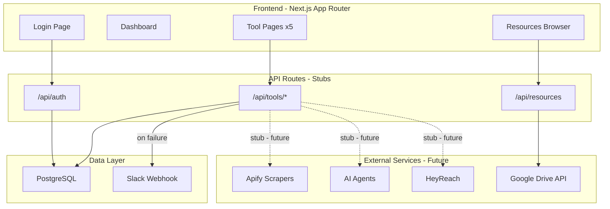

# MVRX Labs Internal Portal

## Tech Stack

- **Framework**: Next.js 15 (App Router) + TypeScript
- **Styling**: Tailwind CSS + shadcn/ui components
- **Auth**: Per-user plaintext passwords stored in the database, JWT session cookies
- **Database**: PostgreSQL (via Vercel Postgres or Neon) + Drizzle ORM for activity logging and user management
- **Rendering**: All pages are client components (`"use client"`) -- NO server components anywhere
- **Notifications**: Slack Incoming Webhook for task failure alerts
- **Google Drive**: Google Drive API for listing files + embedded viewers (iframe) + direct links
- **Deployment**: Vercel ([danny@mvrxlabs.com](mailto:danny@mvrxlabs.com))

## Architecture



## Authentication

Per-user password authentication:

- Each user has their own plaintext password stored in the `users` table (no hashing -- internal tool, admin-managed)
- Login page: user enters their email + password
- Password validated via simple string comparison against the DB value via `/api/auth`
- Session stored in an HTTP-only cookie (JWT containing user ID, name, email, and `isAdmin` flag)
- Middleware on all `/tools/*`, `/resources/*`, `/history/*` routes checks for valid session
- No self-signup, no password change UI for regular users -- admins manage users via `/admin/users`
- All tool runs are attributed to the authenticated user

## Admin User Management

- Accessible at `/admin/users`, restricted to admin emails: `danny@mvrxlabs.com` and `nitanshu@mvrxlabs.com`
- Both the API routes and the client page check for admin status (stored in JWT + verified against DB)
- Admin can: list all users, create new users (name, email, password), edit user details including passwords, delete users
- Simple table UI with inline edit / modal for create/edit

## Database Schema (Drizzle)

```typescript
// src/lib/schema.ts
import { pgTable, text, timestamp, jsonb } from "drizzle-orm/pg-core";
import { createId } from "@paralleldrive/cuid2";

export const users = pgTable("users", {
  id: text("id")
    .primaryKey()
    .$defaultFn(() => createId()),
  name: text("name").notNull(),
  email: text("email").notNull().unique(),
  password: text("password").notNull(), // plaintext
  isAdmin: boolean("is_admin").notNull().default(false),
  createdAt: timestamp("created_at").defaultNow().notNull(),
});

export const toolRuns = pgTable("tool_runs", {
  id: text("id")
    .primaryKey()
    .$defaultFn(() => createId()),
  tool: text("tool").notNull(), // e.g. "linkedin-audit"
  status: text("status").notNull(), // "pending" | "running" | "completed" | "failed"
  inputs: jsonb("inputs").notNull(),
  outputUrl: text("output_url"),
  error: text("error"),
  userId: text("user_id")
    .notNull()
    .references(() => users.id),
  createdAt: timestamp("created_at").defaultNow().notNull(),
  updatedAt: timestamp("updated_at").defaultNow().notNull(),
});
```

## Slack Integration

- Use a Slack Incoming Webhook URL (configured via `SLACK_WEBHOOK_URL` env var)
- A shared `lib/slack.ts` utility sends POST requests to the webhook
- Triggered automatically when a tool run transitions to `status: "failed"`
- Message includes: tool name, user who ran it, error message, timestamp, and a link to the run in the portal
- Simple implementation -- no Slack app or bot needed, just an incoming webhook

## Pages & Routing

| Route                       | Purpose                                      |
| --------------------------- | -------------------------------------------- |
| `/`                         | Login page (email + personal password)       |
| `/dashboard`                | Home -- grid of available tools              |
| `/tools/linkedin-audit`     | LinkedIn Profile Audit tool                  |
| `/tools/linkedin-humanizer` | LinkedIn Post Humanizer tool                 |
| `/tools/gtm-strategy`       | Company GTM Strategy Generation tool         |
| `/tools/sentiment-analysis` | Product Sentiment Analysis & Insights tool   |
| `/tools/outbound-sequence`  | Outbound Sequence Generation tool            |
| `/history`                  | Paginated tool run history (100 per page)    |
| `/admin/users`              | Admin-only user management (CRUD)            |
| `/resources`                | Browse generated resources from Google Drive |
| `/resources/[fileId]`       | View a specific resource (embedded viewer)   |

## Tool Pages (UI Shell)

Each tool page follows a consistent pattern:

1. **Header** with tool name and description
2. **Input form** with relevant fields (varies per tool):

- LinkedIn Audit: LinkedIn profile URL, client/company name
- LinkedIn Humanizer: LinkedIn post URL or paste text, tone selector
- GTM Strategy: Company name, industry, target audience, product description
- Sentiment Analysis: Product name, URLs to analyze, keywords
- Outbound Sequence: Target persona, value prop, number of steps, channel (email/LinkedIn)

1. **Submit button** that POSTs to the corresponding API stub
2. **Status area** showing "processing" / "complete" / link to generated resource
3. **History panel** showing past runs for this tool (queried from `ToolRun` table in Postgres)

Each API stub (`/api/tools/[tool]/route.ts`) will:

- Validate inputs
- Create a `ToolRun` record in Postgres with `status: "pending"` and the authenticated user's ID
- Return a mock "job started" response with the real run ID
- Include TODO comments marking where Apify, AI agents, Google Drive, and HeyReach integrations will go
- On failure: update `ToolRun` to `status: "failed"` and fire a Slack notification via the webhook

## Google Drive Integration

- **Setup**: Google Cloud service account with Drive API access, shared with the target folder (`0AKKJC-_KENtdUk9PVA`)
- **Resources page** (`/resources`): Lists files from the Google Drive folder using the Drive API, organized by client subfolder
- **Resource viewer** (`/resources/[fileId]`): Embeds the file using Google's viewer:
  - Google Docs: `https://docs.google.com/document/d/{id}/preview`
  - Google Slides: `https://docs.google.com/presentation/d/{id}/preview`
  - PDFs: `https://drive.google.com/file/d/{id}/preview`
- **Direct link button**: Opens the file in Google Drive in a new tab for editing
- **Copy content button**: For docs, fetches plain text content via Drive API export so users can paste into Claude/Gemini
- Note to users: Install [Google Drive for Desktop](https://www.google.com/drive/download/) to automatically sync the shared folder to their local filesystem for easy drag-and-drop into AI tools

## Tool Run History Page

- Route: `/history` -- accessible to all authenticated users
- Shows a paginated table of all tool runs across all tools, 100 per page
- Columns: timestamp, user name, tool name, status (with color-coded badge), inputs summary, output link
- Filters: by tool, by user, by status
- Pagination via query params (`?page=1`), fetched from `/api/history?page=1&limit=100`
- API route queries `toolRuns` table with joins to `users`, ordered by `createdAt DESC`

## UI Design

- **All pages use `"use client"` -- no server components anywhere.** All data fetching happens via `fetch` / `useEffect` / SWR/React Query calling API routes.
- Dark theme matching MVRX Labs branding (black background, white/gray text, minimal accent color)
- Clean, dense layout -- this is an internal tool, prioritize information density over marketing polish
- Sidebar navigation with tool list + history + resources link (admin link shown only for admin users)
- shadcn/ui components: Button, Input, Card, Select, Dialog, Tabs, Table, Skeleton loaders
- Toast notifications for job status updates
- Responsive but desktop-first (employees will primarily use laptops)

## Project Structure

```
mvrx/
  src/
    app/
      layout.tsx              # Root layout with sidebar nav ("use client")
      page.tsx                # Login page ("use client")
      dashboard/
        page.tsx              # Tool grid ("use client")
      tools/
        linkedin-audit/
          page.tsx            # "use client"
        linkedin-humanizer/
          page.tsx            # "use client"
        gtm-strategy/
          page.tsx            # "use client"
        sentiment-analysis/
          page.tsx            # "use client"
        outbound-sequence/
          page.tsx            # "use client"
      history/
        page.tsx              # Paginated run history ("use client")
      admin/
        users/
          page.tsx            # User management ("use client", admin-only)
      resources/
        page.tsx              # File browser ("use client")
        [fileId]/
          page.tsx            # Embedded viewer ("use client")
      api/
        auth/
          route.ts            # Login/logout
        tools/
          linkedin-audit/
            route.ts
          linkedin-humanizer/
            route.ts
          gtm-strategy/
            route.ts
          sentiment-analysis/
            route.ts
          outbound-sequence/
            route.ts
        history/
          route.ts            # Paginated tool run list
        admin/
          users/
            route.ts          # CRUD users (admin-only)
        resources/
          route.ts            # List files from Google Drive
          [fileId]/
            route.ts          # Get file details / export content
    components/
      sidebar.tsx             # "use client"
      tool-form.tsx           # Reusable form wrapper
      resource-viewer.tsx     # Iframe embed component
      auth-guard.tsx          # Client-side auth check
    lib/
      auth.ts                 # JWT helpers
      db.ts                   # Drizzle client
      schema.ts              # Drizzle table definitions (users, toolRuns)
      gdrive.ts              # Google Drive API client
      slack.ts               # Slack webhook notification helper
      types.ts               # Shared types
    middleware.ts             # Route protection (checks JWT, blocks non-admin from /admin/*)
  drizzle.config.ts           # Drizzle Kit config
  .env.local                  # DB URL, GOOGLE_*, SLACK_WEBHOOK_URL, JWT_SECRET
  tailwind.config.ts
  next.config.ts
```

## Environment Variables

```
STORAGE_DATABASE_URL=<postgres connection string from Vercel Postgres or Neon>
GOOGLE_SERVICE_ACCOUNT_EMAIL=<service account email>
GOOGLE_PRIVATE_KEY=<service account private key>
GOOGLE_DRIVE_GENERATED_MATERIALS_FOLDER_ID=0AKKJC-_KENtdUk9PVA
JWT_SECRET=<random secret for session tokens>
SLACK_WEBHOOK_URL=<Slack incoming webhook URL for failure alerts>
```

## Deployment

- `vercel` CLI to link to [danny@mvrxlabs.com](mailto:danny@mvrxlabs.com) account
- Set env vars in Vercel dashboard
- Domain: can use default `.vercel.app` or custom subdomain like `portal.mvrxlabs.com`
