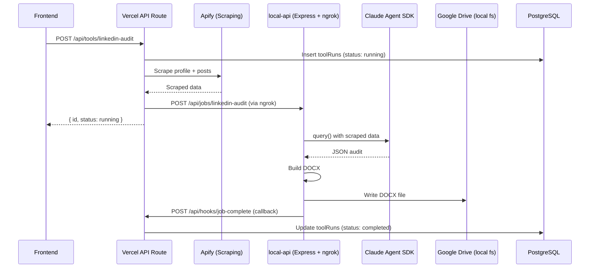
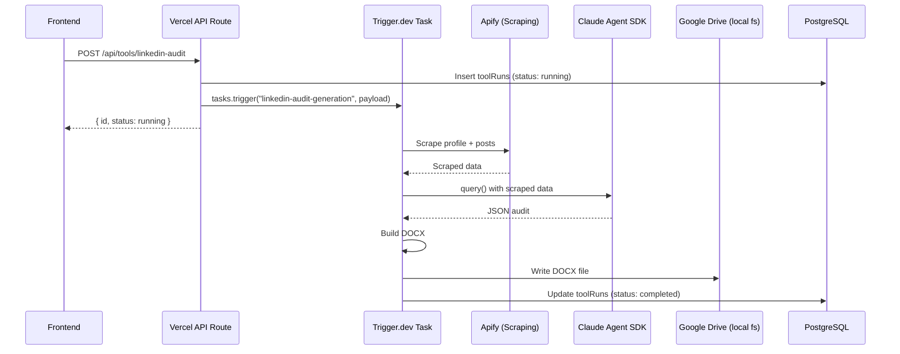

# Trigger.dev LinkedIn Audit Migration

## Current Architecture



## Target Architecture



Key improvements: No ngrok tunnel, no callback pattern, no Express server, no Vercel timeout constraints. The task runs on Trigger.dev's managed infrastructure (locally in dev mode) with retries, logging, and observability built in.

## Step-by-step Plan

### 1. Install dependencies in the root project

The `@anthropic-ai/claude-agent-sdk` and `docx` packages currently live only in `local-api/package.json`. Add them to the root:

```bash
npm install @anthropic-ai/claude-agent-sdk docx
```

### 2. Update `trigger.config.ts`

- Add `@anthropic-ai/claude-agent-sdk` to `build.external` (required per Trigger.dev docs -- it cannot be bundled)
- Set `machine: "small-2x"` (Claude agent needs more resources)

```typescript
build: {
  external: ["@anthropic-ai/claude-agent-sdk"],
},
machine: "small-2x",
```

The existing config already has `maxDuration: 3600` and `retries` configured, which is fine.

### 3. Port shared code from `local-api/` into `src/lib/`

Three files need to move from `local-api/src/lib/` to the shared `src/lib/` directory:

- `**local-api/src/lib/audit-schema.ts**` -> [src/lib/audit-schema.ts](src/lib/audit-schema.ts) (types only, no changes needed)
- `**local-api/src/lib/audit-docx-builder.ts**` -> [src/lib/audit-docx-builder.ts](src/lib/audit-docx-builder.ts) (update import path for audit-schema)
- **Utility functions** from [local-api/src/lib/job-utils.ts](local-api/src/lib/job-utils.ts): `resolveOutputDir`, `resolveModel`, `MODEL_MAP`, `currentMonth`, `extractJSON`, `extractJSONFromSessionDir` -> [src/lib/audit-utils.ts](src/lib/audit-utils.ts)

### 4. Create the Trigger.dev task

Create [src/trigger/linkedin-audit.ts](src/trigger/linkedin-audit.ts) with:

- **Task ID**: `"linkedin-audit-generation"`
- **Typed payload**: `{ runId, linkedinUrl, accountName?, model? }`
- **maxDuration**: `3600` (inherits from config, or set explicitly)
- **Steps**:
  1. Scrape LinkedIn profile via Apify (reuse existing `scrapeLinkedInProfile` from [src/lib/linkedin-audit.ts](src/lib/linkedin-audit.ts))
  2. Run Claude Agent SDK `query()` with the audit prompt and scraped data files (port logic from [local-api/src/jobs/linkedin-audit.ts](local-api/src/jobs/linkedin-audit.ts))
  3. Extract JSON from Claude output
  4. Build DOCX with `buildAuditDocx()`
  5. Write DOCX to Google Drive (local filesystem path -- works in dev mode)
  6. Update `toolRuns` in DB directly via Drizzle (status: completed/failed, output message)
  7. Send Slack notification on failure

The task imports the DB client from [src/lib/db.ts](src/lib/db.ts) and uses it directly -- no callback needed.

### 5. Update the API route

Simplify [src/app/api/tools/linkedin-audit/route.ts](src/app/api/tools/linkedin-audit/route.ts):

- Remove: `withTimeoutGuard`, Apify scraping, ngrok/local-api fetch, all the `NGROK_BASE_URL`/`DANNY_LOCAL_API_KEY` env vars
- Add: `import { tasks } from "@trigger.dev/sdk"` and `import type { linkedinAuditTask } from "@/trigger/linkedin-audit"`
- After DB insert, call `tasks.trigger<typeof linkedinAuditTask>("linkedin-audit-generation", { runId, linkedinUrl, accountName, model })`
- Return `{ id, status: "running" }` immediately

The route becomes ~40 lines instead of ~170.

### 6. Set up environment variables

For local dev (`TRIGGER_SECRET_KEY` goes in `.env.local`):

- Get DEV secret key from [Trigger.dev dashboard API keys page](https://cloud.trigger.dev/orgs/mvrx-labs-3101/projects/mvrx-portal-O8xc/env/dev)
- Set `TRIGGER_SECRET_KEY=tr_dev_...` in `.env.local`

The task itself needs these env vars (which it reads from the same `.env.local` when running via `npx trigger.dev dev`):

- `APIFY_API_TOKEN` (already in `.env.local`)
- `ANTHROPIC_API_KEY` (already in worker `.env.local`, needs adding to root `.env.local`)
- `STORAGE_DATABASE_URL` (already in `.env.local`)
- `SLACK_WEBHOOK_URL` (already present or add)

### 7. Test locally

```bash
# Terminal 1: Next.js
npm run dev

# Terminal 2: Trigger.dev dev server
npx trigger.dev@latest dev
```

Then trigger a LinkedIn audit from the UI and monitor in the Trigger.dev dashboard.

## Key Decisions

- **Apify scraping moves into the task** (not kept in the route). This removes the 300s Vercel timeout constraint entirely. The route becomes a thin dispatcher.
- **DB updates happen directly from the task** via Drizzle. No callback endpoint needed.
- **Google Drive output uses local filesystem** (works in dev mode since `trigger dev` runs locally). For production deployment, this would need to be replaced with Google Drive API, but that's a follow-up concern.
- **The `job-complete` callback route** ([src/app/api/hooks/job-complete/route.ts](src/app/api/hooks/job-complete/route.ts)) is NOT removed yet -- other tools may still use it. Just the LinkedIn audit stops using it.

## Files Changed

| File                                        | Action                                        |
| ------------------------------------------- | --------------------------------------------- |
| `package.json`                              | Add `@anthropic-ai/claude-agent-sdk`, `docx`  |
| `trigger.config.ts`                         | Add `build.external`, `machine`               |
| `src/lib/audit-schema.ts`                   | New (ported from local-api)                   |
| `src/lib/audit-docx-builder.ts`             | New (ported from local-api)                   |
| `src/lib/audit-utils.ts`                    | New (utilities from local-api job-utils)      |
| `src/trigger/linkedin-audit.ts`             | New (the Trigger.dev task)                    |
| `src/app/api/tools/linkedin-audit/route.ts` | Simplified to use `tasks.trigger()`           |
| `.env.local`                                | Add `TRIGGER_SECRET_KEY`, `ANTHROPIC_API_KEY` |
